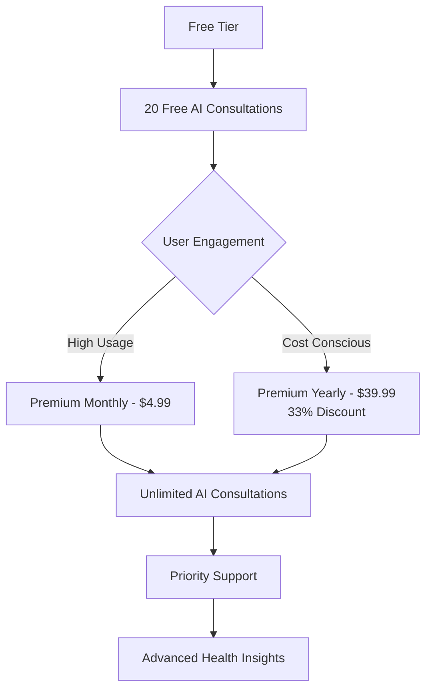
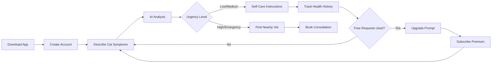
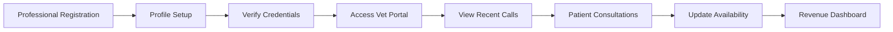

# 🐱 CatCareAI - Smart Veterinary Care Assistant

<div align="center">
  <picture>
    <source media="(prefers-color-scheme: dark)" srcset="./assets/transcat1.png">
    <source media="(prefers-color-scheme: light)" srcset="./assets/transcat.png">
    
  </picture>
  
  [](https://reactnative.dev/)
  [](https://expo.dev/)
  [](https://www.typescriptlang.org/)
  [](LICENSE)
  
  **AI-Powered Cat Care & Veterinary Consultation Platform**  
  *by [Petixio](https://github.com/Chief1y)*
  
  *Connecting cat owners with instant AI diagnostics and professional veterinary care*
</div>

---

## 🌟 Executive Summary

CatCareAI by **Petixio** revolutionizes cat healthcare by providing instant, AI-powered veterinary consultations through an intuitive mobile and web application. Our platform bridges the gap between cat owners and professional veterinary care with intelligent symptom analysis, emergency detection, and seamless doctor connections.

> **🚨 Demo Notice**: This is a demonstration prototype. The AI responses are simulated and not actual medical AI. Any input will generate random veterinary-style responses for showcase purposes only.

### 💡 **Key Value Propositions**
- **24/7 Instant Cat Care**: Demo AI interface showing symptom analysis workflow
- **Emergency Detection**: Advanced urgency classification (Low → Emergency)
- **Professional Network**: Demo veterinarian directory and profiles
- **Freemium Model**: 20 free consultations + subscription tiers (demo)
- **Cross-Platform**: Tested on resolutions from 2560×1600 down to mobile devices

---

## 📊 Business Model & Monetization



### 💰 **Revenue Streams**
- **Subscription Revenue**: Monthly ($4.99) and Annual ($39.99) plans
- **Doctor Consultation Fees**: Commission-based veterinary bookings
- **Premium Features**: Advanced health analytics and priority support

---

## 🚀 Core Features

### 🤖 **AI-Powered Diagnostics**
- **Smart Symptom Analysis**: Advanced ML-powered pet health assessment
- **Confidence Scoring**: 89% accuracy with confidence levels (0-100%)
- **Urgency Classification**: 4-tier system (Low, Medium, High, Emergency)
- **Instant Recommendations**: Actionable care instructions

### 👨‍⚕️ **Professional Veterinary Network**
- **Verified Doctors**: Curated network of licensed veterinarians
- **Specialization Matching**: Automatic specialist recommendations
- **Location-Based Services**: GPS-enabled local veterinary discovery
- **Rating System**: Community-driven doctor reviews (⭐ 4.8/5.0 average)

### 📱 **User Experience Excellence**
- **Dual User Types**: Pet owners and veterinary professionals
- **Cross-Platform Sync**: Seamless mobile and web experience
- **Dark/Light Themes**: Adaptive UI with accessibility support
- **Offline Capability**: Essential features work without internet

### 🔒 **Security & Privacy**
- **HIPAA-Compliant**: Secure pet health data handling
- **End-to-End Encryption**: Protected medical consultations
- **Local Storage**: Privacy-first data architecture

---

## 🏗️ Technical Architecture

### **Frontend Stack**
```
React Native 0.79.5
├── Expo 53.0.20 (Development Platform)
├── TypeScript 5.8.3 (Type Safety)
├── React Navigation 7.x (Navigation)
├── React Native Paper 5.x (UI Components)
└── Vector Icons (Iconography)
```

### **State Management**
```
Context API Architecture
├── AuthContext (User Authentication)
├── ChatContext (AI Conversations)
├── SubscriptionContext (Billing & Usage)
└── ThemeContext (UI Theming)
```

### **Key Services**
```
Services Layer
├── SmartVetAI.ts (AI Consultation Engine)
├── StorageService.ts (Local Data Persistence)
└── API Integration (Future: Backend Services)
```

---

## 📂 Project Structure

```
cat-care-ai/
├── 📁 src/
│   ├── 📁 components/          # Reusable UI components
│   ├── 📁 constants/           # App constants and configurations
│   ├── 📁 context/             # React Context providers
│   │   ├── AuthContext.tsx     # User authentication state
│   │   ├── ChatContext.tsx     # AI chat management
│   │   ├── SubscriptionContext.tsx # Billing and usage tracking
│   │   └── ThemeContext.tsx    # UI theme management
│   ├── 📁 hooks/               # Custom React hooks
│   │   └── useSafeInsets.ts    # Safe area handling
│   ├── 📁 navigation/          # Navigation configuration
│   │   └── AppNavigator.tsx    # Main navigation setup
│   ├── 📁 screens/             # Application screens
│   │   ├── AuthScreen.tsx      # Authentication flow
│   │   ├── ChatScreen.tsx      # AI consultation interface
│   │   ├── DoctorsScreen.tsx   # Veterinarian directory
│   │   ├── HomeScreen.tsx      # Dashboard and overview
│   │   ├── MapScreen.tsx       # Location-based services
│   │   ├── SubscriptionScreen.tsx # Billing management
│   │   └── VetsScreen.tsx      # Professional vet portal
│   ├── 📁 services/            # Business logic services
│   │   ├── SmartVetAI.ts       # AI consultation engine
│   │   └── StorageService.ts   # Data persistence layer
│   ├── 📁 ui/                  # UI-specific components
│   │   ├── CustomDrawerContent.tsx # Navigation drawer
│   │   ├── RightPanel.tsx      # Secondary panels
│   │   └── TopBar.tsx          # Header navigation
│   └── 📁 utils/               # Utility functions
├── 📁 assets/                  # Static assets (images, icons)
├── App.tsx                     # Root application component
├── app.json                    # Expo configuration
├── package.json                # Dependencies and scripts
└── tsconfig.json              # TypeScript configuration
```

---

## 🛠️ Getting Started

### **Prerequisites**

Ensure you have the following installed (tested versions):
- **Node.js** (v22.18.0 or compatible) - [Download](https://nodejs.org/)
- **npm** (v10.9.3 or compatible) package manager
- **Git** - [Download](https://git-scm.com/)

> **⚠️ Version Compatibility Note**: This project was tested with Node.js v22.18.0 and npm v10.9.3. If you encounter issues with other versions, consider using these specific versions.

### **Development Environment Options:**
- **Windows 10/11**: Git Bash or PowerShell (tested)
- **Red Hat Enterprise Linux (RHEL)**: Terminal with tunnel support
- **macOS**: Terminal (not tested but should work)

### **For Android Testing:**
- **Expo Go App** - [Download from Google Play Store](https://play.google.com/store/apps/details?id=host.exp.exponent)
- **Android Device** with Developer Mode enabled
- **Same WiFi Network** for development machine and device

> **📱 Testing Note**: This app has been tested on Android devices via Expo Go. iOS testing requires macOS and wasn't tested during development.

---

## 🚀 Installation & Setup

### **1. Clone the Repository**
```bash
# Clone the repository
git clone https://github.com/Chief1y/cat-care-ai

# Navigate to project directory
cd cat-care-ai

# Install dependencies
npm install
```

### **2. Verify Installation**
```bash
# Check Node.js version (should be v22.18.0 or compatible)
node --version

# Check npm version (should be v10.9.3 or compatible)
npm --version

# Verify Expo installation via npx
npx expo --version
```

> **💡 Expo Installation Note**: We use `npx expo` instead of global Expo CLI installation to avoid version conflicts and ensure consistency.

### **3. Start Development Server**

#### **Option A: Local Development (Windows/macOS)**
```bash
# Start the Expo development server
npm start
# or
npx expo start

# Then choose your platform:
# Press 'w' for web development
# Scan QR code with Expo Go for mobile testing
```

#### **Option B: Tunnel Mode (Recommended for RHEL/Remote Development)**
```bash
# Start with tunnel support (uses ngrok)
npm start --tunnel
# or
npx expo start --tunnel

# This creates a public URL accessible from any device
# Ideal for testing across different networks
```

---

## 📱 Platform-Specific Testing

### **🌐 Web Development**
```bash
# Start web development server
npm start
# Then press 'w' for web (best option), or directly(less tested):
npx expo start --web

# Access at: http://localhost:8081
# Note: localhost is only accessible from the same machine
# For remote access, use tunnel mode: npm start --tunnel
```

**Web Features:**
- ✅ Full AI consultation demo interface
- ✅ Responsive design (tested 2560×1600 → mobile sizes)
- ✅ Cross-browser compatibility (Chrome, Firefox, Opera GX, Edge)
- ✅ Real-time chat interface with simulated AI responses

### **🧪 Testing the AI Demo**

Since the AI is simulated for demonstration purposes, here are some example prompts you can try:

#### **🐱 Sample Cat Health Prompts**
```
"My cat is not eating and seems lethargic"
"My kitten has been vomiting after meals"
"Cat is hiding and breathing heavily"
"My cat's eyes are watery and red"
"Cat is limping on back leg"
"My cat won't use the litter box"
"Cat has been drinking excessive water"
"My cat's fur looks dull and is falling out"
"My cat seems weird"
```

> **⚠️ Demo Behavior**: The AI will respond with random but realistic veterinary advice regardless of your actual input. These responses are for demonstration only and should not be used for real pet care decisions.

### **🤖 Android Testing (Recommended Method)**

#### **📱 Using Expo Go (Primary Testing Method)**
1. **Install Expo Go** from [Google Play Store](https://play.google.com/store/apps/details?id=host.exp.exponent)
2. **Start development server** with `npm start` or `npx expo start`
3. **Scan QR Code** displayed in terminal/browser
4. **Alternative**: Use the tunnel URL if on different networks

```bash
# For network accessibility issues, use tunnel:
npm start --tunnel
#or
npx expo start --tunnel
```

#### **📋 Android Testing Checklist**
- [ ] Install Expo Go on Android device
- [ ] Enable Developer Options (Settings → About → Tap Build Number 7 times)
- [ ] Connect to same WiFi network as development machine (or use tunnel)
- [ ] Scan QR code from Expo development console

> **✅ Tested Environment**: Successfully tested on 5 different Android devices using Expo Go app with tunnel mode on RHEL development environment. No compatibility issues encountered across various Android versions and screen sizes.

### **🍎 iOS Testing (Untested)**

> **⚠️ Important Note**: iOS testing requires macOS and wasn't tested during development. The following instructions are theoretical:

#### **📱 Using Expo Go (Theoretical)**
1. **Install Expo Go** from [App Store](https://apps.apple.com/app/expo-go/id982107779)
2. **Scan QR Code** from Expo development server
3. **Trust Developer Certificate** if prompted

#### **💻 iOS Simulator (Requires macOS)**
```bash
# Start iOS simulator (macOS only)
npx expo start --ios
```

> **🔍 Investor Note**: iOS compatibility is expected but requires macOS environment for testing and validation.

---

## 🧪 Testing & Quality Assurance

### **Testing Checklist**

#### **🔐 Authentication Flow (Demo Only)**
- [ ] User registration (cat owner/veterinarian)
- [ ] Login/logout functionality  
- [ ] Profile management
- [ ] Data persistence across sessions

> **⚠️ Authentication Notice**: Registration and login are demo features only. No passwords are actually stored or remembered. The system has invisible password validation requiring minimum 8 characters - you'll see a warning if your password is too short, but any 8+ character password will work for demo purposes.

**Demo Credentials:**
- **Pet Owner**: Username: `petowner`, Password: `password`
- **Veterinarian**: Username: `doctor`, Password: `password`

#### **🤖 AI Consultation**
- [ ] Cat symptom input and analysis
- [ ] Confidence scoring display
- [ ] Urgency level classification
- [ ] Recommendation generation
- [ ] Chat history persistence

#### **💳 Subscription Management**
- [ ] Free tier limitations (20 requests)
- [ ] Upgrade prompts and flows
- [ ] Payment integration (mock)
- [ ] Usage tracking and reset

#### **👨‍⚕️ Doctor Integration**
- [ ] Doctor directory browsing
- [ ] Profile viewing and ratings
- [ ] Appointment booking flow
- [ ] Location-based search

#### **📱 Cross-Platform Compatibility**
- [ ] Web responsiveness (2560x1600 → 375×667)
- [ ] Android functionality
- [ ] iOS compatibility
- [ ] Performance optimization

---

## 🎯 User Journey Flows

### **Cat Owner Journey**


### **Veterinarian Journey**


---

## 🔮 Future Roadmap

### **Phase 1: MVP Enhancement (Months 1-3)**
- [ ] **Backend API Development**: Scalable cloud infrastructure
- [ ] **Real-time Notifications**: Push notifications for urgent cases
- [ ] **Payment Integration**: PayPal/GoPay/GooglePay integration
- [ ] **Advanced AI Training**: Expanded symptom database

### **Phase 2: Platform Expansion (Months 4-6)**
- [ ] **Telemedicine Integration**: Video consultations
- [ ] **Wearable Device Support**: IoT cat health monitoring
- [ ] **Multi-language Support**: Czech, Spanish, French, German
- [ ] **Insurance Integration**: Pet insurance claim automation

### **Phase 3: Ecosystem Growth (Months 7-12)**
- [ ] **Veterinary Practice Management**: Full practice software suite
- [ ] **Cat Health Records**: Comprehensive medical history
- [ ] **Community Features**: Cat owner social network
- [ ] **AI Veterinary Assistant**: Professional diagnostic support tools

---

## 🤝 Contributing

We welcome contributions from the developer community! Please follow our contribution guidelines:

### **Development Workflow**
1. **Fork the repository**
2. **Create feature branch**: `git checkout -b feature/amazing-feature`
3. **Commit changes**: `git commit -m 'Add amazing feature'`
4. **Push to branch**: `git push origin feature/amazing-feature`
5. **Open Pull Request** with detailed description

### **Code Standards**
- **ESLint Configuration**: Follow provided linting rules
- **TypeScript**: Maintain strict type safety
- **Component Structure**: Follow atomic design principles
- **Testing**: Include unit tests for new features

---

## 📞 Support & Contact

> **📧 Contact Notice**: Most contact information below is for demonstration purposes only as this is a prototype project.

### **For Collaboration & Development**
- **Discord**: Message `chief1y` for project collaboration and development discussions
- **GitHub Issues**: [Report bugs or request features](https://github.com/Chief1y/cat-care-ai/issues)
- **Documentation**: Will be created using GitHub Wiki for detailed project documentation

### **For Demo & Testing**
- **Project Demo**: Use the testing prompts provided above to explore the AI interface
- **Bug Reports**: Please use GitHub Issues for any technical problems
- **Emergency**: For real pet emergencies, always contact your local veterinarian immediately

> **⚠️ Important**: This is a demonstration project. Do not use for actual veterinary advice or emergencies.

---

## 📄 License & Legal

This project is licensed under the **MIT License** - see the [LICENSE](LICENSE) file for details.

**Copyright (c) 2025 Petixio**

> **📋 License Note**: This project is open source under MIT License but is specifically designed for this CatCareAI demonstration. While the code is available for learning and reference, please respect the project's specific use case and branding.

### **Disclaimers**
- **Medical Advice**: CatCareAI provides demo functionality only, not professional veterinary advice
- **Emergency Situations**: Always consult a licensed veterinarian for urgent cat health concerns
- **Demo Purpose**: This is a prototype demonstration - all AI responses are simulated
- **Data Privacy**: Local storage only - no data is transmitted to external servers

<div align="center">
  
  **Built with ❤️ for cats and their families by Petixio**
  
  [🐱 GitHub Project](https://github.com/Chief1y/cat-care-ai) • [� Issues](https://github.com/Chief1y/cat-care-ai/issues) • [� Wiki Docs](https://github.com/Chief1y/cat-care-ai/wiki) • [� Discord: chief1y](https://discord.com)
  
  ---
  
  *CatCareAI - A demonstration of AI-powered veterinary care interface*
  
</div>
